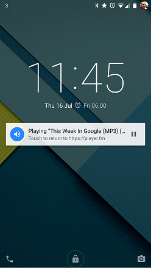

Gathering information is easier now than it ever has been before.  Ever since the internet became a world wide phenomenon, people from all across the globe could find other people that shared their interests and exchange knowledge and information, making everyone else smarter for it.  Unfortunately, the internet is still a new invention, so a majority of the people in the world still hasn't adapted to the culture of the internet.  Thus, when people who haven't assimilated to internet culture find themselves in forums, making posts, and asking questions, they can often come across as uninformed or lazy to the veterans in the forum.  And the newcomers may feel as if they were treated poorly and come away with the impression that people on the internet are rude and unhelpful.

## How Most People Ask Questions
Most people tend to ask questions like this:

```
New version of my app is 1.2. But in "Sales and Trends" in iTunes Connect I see "unknown" app version. Also new reviews not showing in App Store in "Current version" tab (only in all versions tab). What's wrong?
```

And prior to the internet, this was a completely legitimate way to ask a question.  Most people may look at the question and not find anything wrong with it.  This is because when we interact with people face to face, these are the kinds of questions that we tend to ask.  We give the person in front of us a basic rundown of what the problem is, and then ask them for advice.  We tend to keep the question a lot shorter in order to make sure that we aren't dominating the conversation.  And it's perfectly alright to do so since the person is right in front of you, only interacting with you, and they can ask you follow up questions very easily.  Therefore, giving them the whole picture from the start isn't entirely necessary.

Unfortunately, this is also the easiest way to either get a poor answer or get ignored.  This is because there are far too many elements missing from the question.  What type of device are they using?  Version of Swift?  Does this problem occur on other devices as well?  Is this an app that you developed or was this simply one that you downloaded?  But the worst part, is that the person reading the question isn't sure how the original poster got to this problem.  There's no way they are capable of replecating the problem, so there's no way to tell for sure what answer will definitely solve the problem.  

Some people may not even want to help the original poster anyways, because the question also displays a lack of effort.  They don't inform the reader of any of the steps that they had gone through in order to attempt to fix the problem (assuming that they did attempt to solve the problem themselves at all).  As it stands, the reader gets the impression that the poster had encountered the problem, gave a simple shrug, and then posted a question on a random forum in the hopes of getting an answer.

In this individual's case, they were lucky enough to get an answer from somehow who does seem to genuinely want to help.

```
I was having the same problem. I updated the latest version. I cleared out my browser history and cache and it is now working. If that doesn't work for you, try another browser. I usually use Chrome. Before clearing out Chrome's cache/history, I decided to try Safari. No luck. Then I tried Firefox and it worked there.

I've also noticed it can take several days for thing to update consistently across all the various pages. Like sales may not show anything for a recent week, but if I wait long enough and update/clear/etc, sales data shows.
```

However, this answer will only help the poster if the origin of their problem is the same as the person who answered.  If they have different causes for the problem, then the answer is effectively worthless to the poster.  This is the worst possible scenario.  However, even in the best possible scenario, and the poster does somehow manage to solve their problem, there really isn't anything new that they learned by solving the problem.  Why their system was acting in that manner? How to prevent it from happening in the future?  Problems that users run into is a chance for them to learn from their mistakes, and become better for it.  And the person who asked this question simply missed an opportunity to learn.

## How Most People Should Ask Questions

In contrast, this is how questions should be asked:
```
My HTML5 game has some background music that uses Howler.js in "html5" mode, which apparently triggers Chrome for Android's media playback notifications. This means a notification appears while the user has my game open in any tab:
```


```
The game is a good citizen and pauses the music while the tab is not in focus, so there is no need for this notification. It's even actively confusing, because the user can pause and resume the game's background music without being in the game. But I can't find a way to get rid of the notification.

I tried calling stop() instead of pause() or mute() on the music object, but this doesn't remove the notification.

Looking a bit deeper, I discovered the experimental MediaSession API (W3C draft) which supposedly can be used to control the notification. But, if I understand correctly, it offers no way to disable it outright!

I tried this at the start of my application:
```

```javascript
if (typeof navigator.mediaSession == 'object') {
  navigator.mediaSession.playbackState = 'none'
}
```

```
However, this only sets the declared playback state (in spec terminology). And setting that to 'none' has no effect:

----------------------------------------------------------------
The actual playback state is computed in the following way:

If the declared playback state is "playing", return "playing".
Otherwise, return the guessed playback state.
----------------------------------------------------------------

And the guessed playback state is something I have no control over; it's derived by the browser based on the state of <audio> elements on the page.

Is there a possibility that I'm overlooking, or is this just an oversight in the current MediaSession specification?
```

