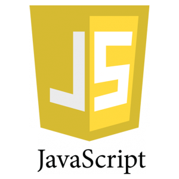

## Javascript vs Python

 

One of the first things I noticed when using the Javascript language is how similar it was to Python.  Unlike Java, Javascript didn't require the creation of a Main class to run the program.  Unlike C/C++, creating function declarations isn't necessary.  Python shares these properties along with many others such as: not requiring type declarations for variables, allowing arrays to contain values of different data types, and automatically passing objects and arrays into functions by reference.  

However, one of the major differences between Python and Javascript is their syntax.  Javascript, like Java and C/C++, requires a semicolon be placed at the end of a line of code, as well as curly braces surrounding the body of flow control statements such as "if" and "while" statements.  These two languages also differ in how they treat classes.  Javascript essentially treats classes like a function, and only adding the "class" as a keyword to make programming easier.  This means that you can create a function in Javascript that acts identical to a class in javascript:

```javascript
function Obj(x, y) {
    this.x = x;
    this.y = y;
}

Obj.prototype.z = function() {
    console.log("Function");
}

class ObjClass {
    constructor (x, y) {
        this.x = x;
        this.y = y;
    }
    
    z() {
        console.log("Function");
    }
}
```

However, in Python, the only way to create a class is by using the "class" keyword.  There are several other minor differences between Python and Javascript, such as for loop syntax, but these are the more intricat differences between the languages.

## Javascript as It Stands

Javascript, when looking at it on its own, is a fairly powerful language.  One of the main advantages that it has compared to other languages is the support it has on webpage browsers and HTML.  This makes it easier to integrate javascript code into websites, and allows a larger audience to access the code that you had written.  Javascript also simplifies the experience for end users, as there isn't any need to "compile" code like in C languages, and Java.  

One interesting aspect of Javascript is the emphasis of the language seems to be away from Object Oriented Programming.  The reason I believe this is because of the way they allow functions to act similarly to classes, and thus makes classes feel more like an afterthought than an integral part of the programming language.  Compare this to Java, where the developer needs to create a Main class before they can even run code, and it becomes clear that the focus was heavily on Object Oriented Programming.  This doesn't necessarily mean that Javascript doesn't do Object Oriented Programming well, this just means that this wasn't the intended purpose for the language.  I believe that the intended use of javascript was to work well with HTML, and allow devlopers to create websites and make them more dynamic than they would have otherwise been able to with just the tools they have in HTML and CSS.

## Programming Under Pressure

Deviating from the Javascript language, 
