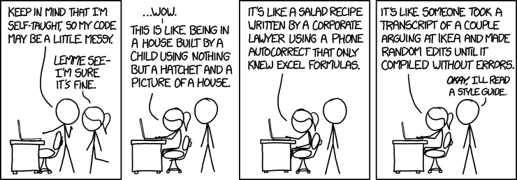

An aspect of software engineering that people may overlook is the way that their code is styled.  If the programmer is fairly new and inexperienced, they may believe that so long as the code compiles and runs properly there is nothing else that could possibly be wrong with their code.  However, compare the code that follows a coding style
```javascript
let x = 0;
if (x > 10) {
  x += 5;
} else {
  x += 100;
}
```
To code that does not
```javascript
let     asdfqwer=           0;  if(asdfqwer>10){
asdfqwer += 5

;

}


else{
                 asdfqwer += 100;
                 }
```

Clearly, the code without any style is more difficult to read.  Some inexperienced programmers may believe that code that is difficult to read doesn't matter since the code will be run by the computer anyways.  However, other people have to read the code you wrote as well.  There are mainly two situatios where this occurs.

## Collaboration With Others
Stereotypically, programmers are working in dimly lit basements, completely isolated from the rest of the world.  However, software engineers need to work with an entire team of other programmers in order to accomplish their goals in a reasonable amount of time.  The website for Amazon's site could not have realistically been developed by a single person, and this holds true for other software such as: Siri, Google, and Github.  When working with a larger team of people, you need to be able to write code that other people will be able to quickly and easily understand the logic behind what was written.  The underlying logic of the code may be complex, and competing coding styles can simply make trying to understand complex code a more difficult ordeal.

## Future Updates
Now let's assume that you created a project with a group of people without following some sort of coding standard.  Now what if you want to update the software 10 years from now.  You aren't going to remember the logic that you had for the code you wrote, and the documentation may not be enough to get you back up to speed on the program.  Therefore, you would have to resort to rereading the code, and this can become a much bigger problem if you have a difficult time understanding the code that you had written for yourself.

## Benefits to Coding Standards
Even though there are a lot of cons to not using coding standards, there are also some benefits you gain from learning coding standards.  One of the most prominent ones I've experienced is learning a programming language faster.  When there's a specific structure in how the code is written, then it's much easier to pick up the syntax that is necessary for the language to run since the code often has a format that I can follow, and almost always consistently looks the same.

```javascript
for (let a = 0; a < 5; a++) {
  console.log(a);
}

for (let b = 0; b < 20; b++) {
  console.log(b % 2);
}

for(let      c = 0;c <       5; c ++)
{
console.log(c);}
```
For loops a and b look very similar, and thus I have an easier time modifying those for loops into the format that I need.  However, for loop c looks like an inconsisten mess, and I would have a difficult time recreating this loop for when I need to write my own code.

However, in the end, the main advantage of having a coding standard is because the code looks a lot nicer.  It's simpler and easier to read, and more enjoyable for us.  And that's really the only reason a software engineer should need to follow a coding standard.  Some of the largest triumphs I've had in my limited time as a programmer is writing code that looks nice, and the logic behind the code is extremely clear and concise.  I believe that there is no other reason anyone should need in order to follow the code in this format when this is the case.
