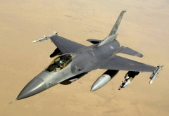

During my internship at Raytheon, I was working on a project for their space and airborne systems.  Due to the nature of the internship, I can't go into too much detail about what the project I had worked on was about.  However, I gained a lot of project experience during my two and half months as a software engineering intern at this company.

I had gained more experience developing in C and C++, which is the language that I used for the back end portion of the project.  For the front end portion, I used Python and the Tkinter library.  I also learned how to read other people's code, as well as code that was written several years ago.  The code often required new hires to know a lot more technical information and background they likely had at the time, so I also learned how to pick up information from other people and use them in the project that I was currently working on.  I also developed some soft skills as well, such as reaching out to other people in the company who were experts in certain aspects of my project, and getting useful information from them.

<a href = "https://jobs.raytheon.com/space">Raytheon's Space and Airborne Systems Page</a>
