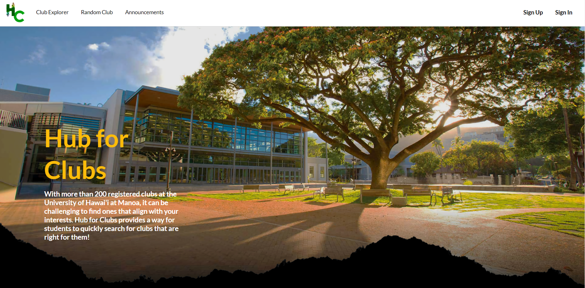

The website that we created is to help students find clubs that are suited for them.  Currently, the only to find clubs at the University of Hawaii at Manoa is to look through a long list of clubs and judge them based solely on their club name.  However, with our app, clubs can be found based on interests that the user has.  This way clubs that are of interst to the user can be found more easily.  Clubs are also associated with a list of tags such as Academic, Art, and Technology.  Users are then able to narrow down the clubs that they are interested in.  Club leaders are also able to make announcements to users in order to advertise events to people that may be interested.  

The contributions I made to the project involved a large amount of the functionality.  This includes the Club Explorer page, finding random clubs, finding clubs based on a person's interest, the Profile page, and the functionality for the leaders and admin accounts.  I was also responsible for a few of the design choices for the website.

Through the process of this project, I gained some experience in the software engineering process.  Working in teams can be difficult, especially if some don't carry as much weight as what would be appreciated.  However, there are ways around it.  People can be assigned to perform different tasks, and problems can be solved to the best of our abilities.  Knowing where certain lines have to drawn in the plan is also important.  During the initial planning of the website, we had several more features that we wanted to add, but given the constraints we had, we weren't able to add these features.  However, certain traces of the features can be found in our code, but we abandonded them upon realizing that there wouldn't be enough time to get the website properly running and have those features integrated with the site as well.

<a href="https://github.com/Hub-for-Clubs">GitHub Repository<a/>
